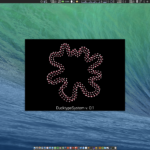
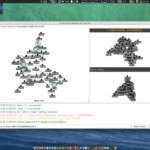
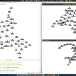

Un algoritmo distribuito per il problema del subgraph isomorphism
=================================================================

#### Anna Becchi - Idriss Riouak

Si consideri un sistema multi-agente, in cui una flotta di agenti comunicanti (ad esempio robot o droni) stanno visitando un ambiente sconosciuto (un edificio, un territorio) ed ognuno sta raccogliendo gradualmente informazioni sulla topologia del luogo. Ogni nodo ha una visione soggettiva ed incompleta del contesto e, a causa di limitazione di banda, tempo o memoria dei nodi, non esiste un nodo che ha la visione complessiva del grafo dell'ambiente. In tale situazione, sorge il problema del _distributed subgraph isomorphism_, ossia trovare un isomorfismo tra un certo grafo dato e un sottografo del grafo host complessivo (e distribuito). Questo problema può essere usato per determinare vie di fuga o di accesso a zone impervie, specifici ambienti, ecc. In questo progetto si presenta una soluzione a tale problema, partendo dalla definizione formale fino ad arrivare all'implementazione che simula l'ambiente fisico di esecuzione, con interfaccia grafica e una classe di file di test.

E' possibile scaricare l'intero progetto da [GitHub](https://github.com/IdrissRio/DucktypeSystem). Per eseguire il progetto è sufficiente lanciare lo script \`./dsquack' Tutte le informazioni riguardanti la struttura delle cartelle dei sorgenti, le modalità di esecuzione e di testing e la lettura dei messaggi di log interni si possono trovare nel file [README](https://github.com/IdrissRio/DucktypeSystem/blob/master/DS-BecchiRiouak/README). Hint: un comodo ambiente di sviluppo per analizzare i sorgenti ed eseguire il progetto è \`[IntelliJ Idea](https://www.jetbrains.com/idea/)'.

L’ambiente di sviluppo è stato scelto in modo da poter evidenziare solamente le caratteristiche più rilevanti del problema. Il sistema è stato implementato in [Akka](https://akka.io), un toolkit costituito da un insieme di librerie open source per la progettazione e creazione di sistemi distribuiti e concorrenti, con supporto alla scalabilità e alla fault tollerance, eseguibile su una JVM. Il toolkit è disponibile sia per il linguaggio imperativo usato (Java) che per il funzionale Scala e attualmente la versione più aggiornata è la 2.5.4. Akka si basa sul modello ad attori: un’astrazione utilizzata per effettuare analisi sulla concorrenza e per la progettazione ad alto livello di sistemi distribuiti. Lo scopo del modello è quello di risolvere le questioni relative alla concorrenza e alla memoria condivisa, eliminandola completamente e sgravando dunque il programmatore da questi problemi. Le comunicazioni tra le varie componenti del sistema sfruttano principalmente il meccanismo di Distributed Publish Subscribe in Cluster offerto da Akka. Esso consente di comunicare con un insieme di attori che si dichiarano interessati a un determinato topic senza che il mittente conosca gli ActorRef dei destinatari. Per questi motivi risulta una funzionalità particolarmente adatta al sistema in questione perché garantisce una massima location transparency tra i diversi Actor System. Gli attori membri di un cluster possono iscriversi a un path oppure a un subject; l’invio di un messaggio tramite il DistribuitedPubSubMediator di Akka può essere eseguito in modalità:

1.  SendToAll / Publish, il messaggio viene ricevuto da tutti gli attori iscritti, eventualmente settando il parametro allButSelf che esclude il mittente;
2.  Send, il messaggio viene ricevuto da un solo attore iscritto al cluster, eventualmente specificando la preferenza location affinity.

### Screenshots

