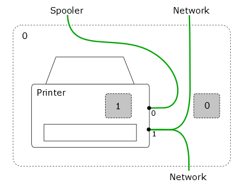

A library for Bigraphs and Bigraphic Reactive Systems.
======================================================

Bigraphs and Bigraphical Reactive Systems are a modern, graphical calculus for the description of the syntax and semantics of systems in terms of the orthogonal notions of _connectivity_ and _locality_ but have been successfully applied also in other fields such as knowledge representation and manipulation. Bigraphs were proposed by Robin Milner and colleagues in 2000, and have been under development since. We refer the reader to Milner's book _The space and motion_ _of communicating agents_ or to [this site](http://www.itu.dk/research/pls/wiki/index.php/A_Brief_Introduction_To_Bigraphs) for a brief introduction to bigraphs. (Several works and projects involving bigraphs are collected at [this site](http://bigraph.org/).) jLibBig aims to offer an implementation of bigraphic reactive systems but also to provide some tools and the infrastructure for extending them or implement the brand new flavours of bigraphs in order to meet requirements of a wider spectrum of scenarios. Part of this extensibility is achieved thanks to the _attached properties_ which allows to dynamically extend the structure of bigraphs by attaching attributes or properties (thay may be mutable) to e.g. nodes. For instance, attached properties can be used to store concrete values such as ip addresses or user permissions without the need to encode all this information in the standard bigraphic language reducing the burden of the encoding and resulting in a streamlined model without loss of information thanks to this new layer of abstraction. Matchings and rewritings can be customised to take into account also attached properties and hence, the need to re-implement the whole bigraph framework to meet particular use cases is drastically reduced. The library provides a default implementation of bigraphs. The classes Bigraph and BigraphBuilder provides methods for assembling bigraphs programmatically but importers from some textual representations are offered. Milner's algebra is supported in the form of methods exposed by Bigraph and BigraphBuilder implementing operations (such as composition, juxtaposition, or nesting) and elementary bigraphs (such as identities or ions). However, BigraphBuilder can be used to modify bigraphs more freely by not necessarily constructive operations. For instance, the following Java program defines a signature with a single control (called Printer) with two ports, then constructs the bigraph pictured below.

```text
import it.uniud.mads.jlibbig.core.std.*;

public class SimpleBig {
    public static void main(String[] args) {

        SignatureBuilder signatureBuilder = new SignatureBuilder();
        signatureBuilder.add(new Control("Printer", true, 2));
        Signature signature = signatureBuilder.makeSignature();

        BigraphBuilder builder = new BigraphBuilder(signature);
        OuterName spooler = builder.addOuterName("Spooler");
        OuterName network = builder.addOuterName("Network");
        Root root = builder.addRoot();
        Node printer = builder.addNode("Printer",root,spooler,network);
        builder.addSite(root);
        builder.addSite(printer);
        builder.addInnerName("Network",network);
        Bigraph bigraph = builder.makeBigraph();

        System.out.println(bigraph);
    }
}
```



Attached properties can be used to dynamically attach additional information. For instance, the printer node can be decorated with the default paper format or its network alias:

```text
printer.attachProperty(new ProtectedProperty<String>("NETWORK_ALIAS","Lab printer"));
```

Properties can be easily read:

```text 
Paper format = printer.<Paper>getProperty("DEFAULT_FORMAT").get();
```

or written:

```text
printer.<Paper>getProperty("DEFAULT_FORMAT").set(Paper.A4);
```

Much of the information expressible by attached properties can be easily encoded in the bigraphic language, but there are cases requiring to extend (and hence re-implement) the bigraphic machinery.
For instance, spatial information can be represented bigraphically, but in a rather abstract way. What if we are interested in the nearest printer or in the access point with the strongest signal? The following concise example illustrates how the matcher can be instructed to consider access points (nodes decorated with the “AP_C” control) within the range.

```text
Matcher matcher = new Matcher(){
   protected boolean areMatchable(Bigraph agent, Node nodeAgent, Bigraph redex, Node nodeRedex) {
      if(super.areMatchable(agent,nodeAgent,redex,nodeRedex)){
         if(nodeAgent.getControl.equals(AP_C))
            return checkDistance(nodeAgent);
         else
            return true;
      }
      ;return false;
   }
};
for(Match m : matcher.match(bigraph,redex)){
   doSomethingWithThisMatch(m);
};
```
However optimal solutions are supported too:

```text
Matcher matcher = new WeightedMatcher(){
   protected int matchingWeight(Bigraph agent, Node nodeAgent, Bigraph redex, Node nodeRedex) {
      if(nodeAgent.getControl.equals(AP_C) && nodeRedex.getControl.equals(AP_C))
         return getDistance(nodeAgent);
      else
         return super.matchingWeight(agent,nodeAgent,redex,nodeRedex);
   }
};
```

### Downloads and resources
    
#### Library classes and interfaces

The core library provides the main infrastructure of LibBig, the abstractions shared by bigraphs and their main extensions and a default implementation of BRS (with abstract names). The ldb library implements the "directed bigraphs" variant.

Ordinary and weighted matches are implemented as constraint satisfaction problems which are then solved by means of the [CHOCO Solver.](http://www.emn.fr/z-info/choco-solver/)

*   [GitHub repository](https://github.com/bigraphs/jlibbig);
*   [JAR class file](https://www.dropbox.com/s/s1wxu0f87n46ymp/jlibbig.jar?dl=0) version 0.2, without dependencies. If you intend to use the matching functionalities, a library for the CHOCO 4 solver is required (it can be dowloaded, e.g. [from Maven repository](https://mvnrepository.com/artifact/org.choco-solver/choco-solver)).
*   source files [JAR](https://goo.gl/8yOEze);
*   documentation [ZIP](https://goo.gl/7IX6km);

#### BigMC interoperability

Tools for basic handling of BRSs complaint with [BigMC](http://bigraph.org/bigmc/) (a bigraphic model checker). The package includes import/export utilities targeting BiGMC text format. The [beaver](http://beaver.sourceforge.net/) library is required.

*   class files [JAR](https://goo.gl/ZTDRGN);
*   source files [JAR](https://goo.gl/WwCDnu);
*   beaver 0.9.x [ZIP](https://goo.gl/xnz8ec).

#### UDLang

Tools targeting UDLang, a text format for encoding bigraphic reactive systems. The [beaver](http://beaver.sourceforge.net/) library is required.

*   class files [JAR](https://goo.gl/dVfQCG);
*   source files [JAR](https://goo.gl/cERHcV);
*   beaver 0.9.x [ZIP](https://goo.gl/xnz8ec).